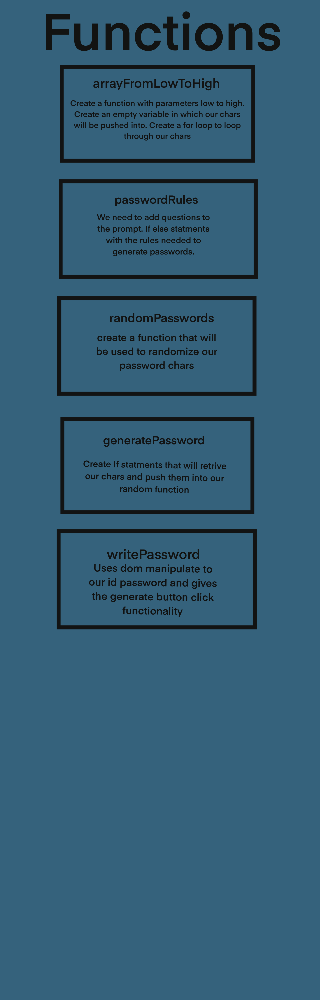

# <Password-Generator>

## Description

Provide a short description explaining the what, why, and how of your project. Use the following questions as a guide:

- What was your motivation? This project should help my understand how functions and methods work together. In strive of increasing my knowledge, my goal is to research other password generators to have an idea of how to go about my project.
- Why did you build this project? 
- What problem does it solve?
- What did you learn?

    
    
   

## License

License can be found in the repo.

## Badges

